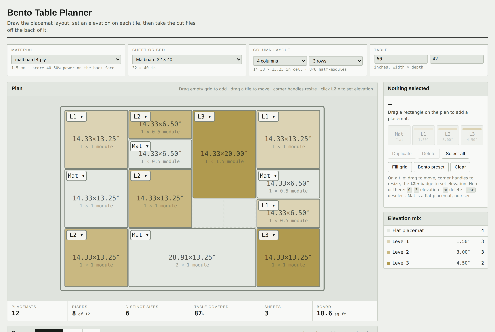

# Bento Table Planner

A planning tool for an exhibition table: draw the bento placemat layout, set an
elevation on each tile, preview the whole table in isometric and elevation, then
generate laser-ready fold-up riser templates from it.

**Live tool:** `docs/index.html` is a single self-contained page — open it locally,
or host it anywhere static. Paste the URL here once it's up.



## What it does

- **Plan.** The table drawn to scale over a half-module grid. Drag empty grid to
  create a placemat, drag a tile to move it, corner handles to resize, and an
  on-tile `L2 ▾` badge to set elevation.
- **Preview.** Isometric, front and side elevation. The isometric view is fully
  editable too — same select, move, resize and elevation controls.
- **Generate template.** Every riser nested across as many sheets as it takes,
  one tab per sheet, exported as layered 1:1 mm SVG.

## The geometry

Score on the inside, fold the walls down 90°. The fold pivots about the inside
surface, so the top panel is cut `footprint − 2t` and the walls `height − t`. The
folded exterior then matches its grid footprint exactly and the top surface lands
on the stated elevation. Corners close by running the end walls long by one
thickness so they wrap the side-wall edges; glue tabs land on the inside, hidden.
Kerf is compensated on slots only.

Two constructions, picked per riser by whichever nests better:

| | flat size | wins when |
|---|---|---|
| **one-piece** | a cross, `footprint + 2 × height` each way | under ~3 in tall, where corner waste is 2–6% |
| **panel + walls** | a flat top panel plus folded wall strips | above ~3 in, since corner waste grows with height² |

At 6 in tall the second gets 2–2.5× more risers per sheet. Wall strips auto-split
(2 L-pieces → 4 separate walls → spliced) so no piece ever exceeds the sheet.

## The grid

Counted in **half modules**, because a bento layout splits cells. With a
half-unit `h = (cell − gap) / 2`, a run of `k` half-units measures
`k·h + (k−1)·gap` — so `k=2` returns exactly one cell.

Gap and margin are both parameters, and you choose which side of the equation
you're driving:

- **Fit table** — margin and gap are the inputs, and the placemats size
  themselves to fill what's left. This is usually what you want: the edge you
  keep clear and the gap between mats are the real design decisions.
- **Fixed cell** — cell size and gap are the inputs, and the leftover becomes a
  centred margin. Use it to pin mats to a physical dimension.

Both defaults describe the same layout: a 0.965 in side margin and 0.875 in
front margin on a 60 × 42 in top give exactly 14.33 × 13.25 in cells, which is
where the original Figma study landed. Whichever pair is derived shows greyed
out, and the conversion on switching modes is a stable fixed point, so flipping
back and forth never creeps the layout.

## Layout

```
src/planner.html    the tool. Authored as Artifact body content, so it carries
                    no doctype/head/body — tools/make_site.py adds those.
src/riser.py        one-piece cross net, ribs, gussets, MaxRects nesting, SVG
src/band.py         panel + wall-strip construction, auto-picks L2 / W4 / W4S
src/build.py        cut list → sheet SVGs + a BUILD.md build sheet
src/preview.py      dependency-free raster preview, for eyeballing a net
tools/make_site.py  wrap the tool into docs/index.html for static hosting
tools/make_ref.py   emit reference geometry for the JS cross-check
tests/              see below
docs/index.html     the built, hostable page
```

## Tests

```sh
./run_tests.sh
```

- `tests/verify.py` — fold maths, tab clearances, slot kerf, packing, SVG output
- `tests/compare.py` — construction comparison, and where the material crossover falls
- `tests/xcheck.js` — proves the browser tool's JS geometry matches the Python **exactly**
- `tests/layoutcheck.js` — table grid, tile placement, SKU rollup, multi-sheet nesting,
  and that the isometric inverse projection round-trips

The cross-check matters: the same geometry is implemented twice, once in Python for
batch work and once in JS for the browser. `xcheck.js` runs the real functions
extracted from `planner.html` against Python-generated reference values, so the two
can't drift.

## Batch use, without the browser

```sh
cat > cutlist.txt <<'LIST'
# QTY  WxDxH(inches)  [auto|band|one-piece]
4   14.33x13.25x3
6   14.33x6.5x1.5   one-piece
2   19.25x13.25x4.5 band
LIST
python3 src/build.py --list cutlist.txt --out out/ --gussets 2
```

Writes `out/sheet-01.svg …` plus `out/BUILD.md` with cut dimensions, assembly
steps and yield.

## Laser layers

Red `#FF0000` cut through · blue `#0000FF` score/fold · green `#00A000` engraved
labels. Output is true 1:1 millimetres, so LightBurn, RDWorks, Illustrator and
Inkscape all import at size.

## Before you cut

- **Score face-down, cut face-up**, so the crushed side ends up inside the riser.
- **Prime both faces before colour** — raw matboard drinks paint and cups.
- **A 1.5 mm panel spanning over ~10 in will visibly sag** under real weight. Add
  the crossed ribs, laminate a second panel underneath, or move that riser to the CNC.
- **Level 0 tiles cut no riser** — they're the flat placemat.

## Known limits

- One grid per table. The original study had separate "table divisions" with their
  own column counts; that isn't modelled yet.
- The isometric camera is fixed — no orbit.
- A tall riser genuinely occludes a flat mat behind it in isometric, so a few tiles
  can't be clicked there. Select them anywhere else and their controls surface on top.
